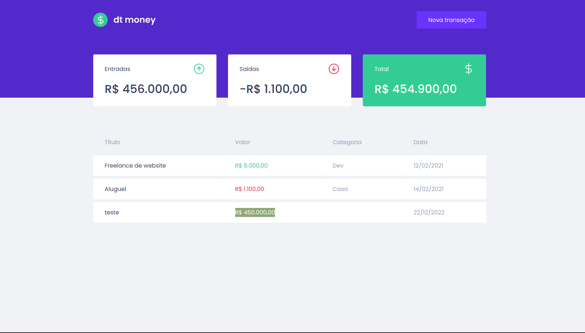

## Dtmoney

Dtmoney is a simple project to manage expenses, using React + Mirage JS + Styled Components + React Modal + Polished

## Layout


## Installation

Use a package manager of your choice (npm, yarn, etc.) in order to install all dependencies

```bash
yarn
```

## Usage

Just run `start` script.

```bash
yarn start
```

## Contact

Any question, bug and comment, you can mail me in gabrielhenrique.ls96@gmail.com or use Issues tab here in GitHub

Thank you.
